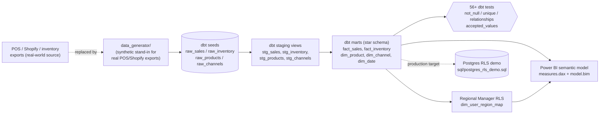

# retail-margin-cockpit

**A governed margin and inventory source of truth for small/mid retail and DTC teams - dbt star schema, DAX measure library, and RLS-scoped Power BI cockpit, built on data that used to live in five different spreadsheets.**


## The problem

At small-to-mid retail and DTC companies, "what's our margin?" is usually a multi-hour Friday-afternoon exercise: someone exports the POS system, someone else exports Shopify, inventory counts live in a separate ledger or a spreadsheet someone maintains by hand, and none of it joins cleanly because product IDs and channel names don't match across systems. Finance gets a different margin number than Ops. Nobody trusts the stockout report because it's stale by the time it's built. And a Regional Manager who should only see their own region's numbers instead gets a filtered copy of a spreadsheet, maintained by hand, that's one missed filter away from leaking company-wide numbers.

`retail-margin-cockpit` is a working prototype of the fix: a small, governed dbt project that turns raw POS/Shopify/inventory exports into a tested star schema, plus the DAX measure library and row-level-security design that make that schema usable in Power BI by the people who actually need it - without another hand-maintained spreadsheet.

## How it works

1. **`data_generator/`** - a seeded Python generator produces two years of realistic, internally-consistent retail history (five channels across three regions + online + wholesale, 32 SKUs across four categories, seasonality, promo windows, weekly inventory snapshots, occasional stockouts) as the four raw CSVs a real retailer's POS/Shopify/inventory exports would look like. Same seed, same bytes, every run - which is what makes the pipeline downstream reproducible and testable.
2. **`dbt/retail_margin_cockpit/`** - a dbt project that seeds those CSVs, builds thin staging views, and materializes a star schema (`fact_sales`, `fact_inventory`, `dim_product`, `dim_channel`, `dim_date`, `dim_user_region_map`) with `not_null` / `unique` / `relationships` / `accepted_values` tests on every key column and documented column-level descriptions (`dbt docs generate` works out of the box). Targets DuckDB by default (embedded, zero-setup, what CI runs) and Postgres for production (`dbt build --target postgres`) - same SQL, same tests, either target.
3. **`powerbi/`** - a hand-written DAX measure library (`measures.dax`: gross margin %, sell-through %, inventory turns, YoY/MoM revenue, effective discount %, stockout rate, and more) and a TMSL semantic model (`model.bim`) with two row-level-security roles - **Regional Manager** (dynamic RLS scoped to one region via `dim_user_region_map`) and **HQ Analyst** (unrestricted) - documented report pages, and the bookmark/drillthrough design. `model.bim`'s measures are generated from `measures.dax` by `scripts/build_model_bim.py` so the two never drift apart.
4. **`sql/postgres_rls_demo.sql`** - the same regional-manager access boundary enforced one layer down, as native Postgres row-level security, for the SQL clients and pipelines that don't go through Power BI at all.



## The insight (why this matters)

Building this out on the synthetic two-year dataset surfaces exactly the kind of thing this cockpit exists to catch: **Footwear quietly runs 7-8 margin points below every other category, in every single channel.**

| Category | Revenue | Gross Margin % |
|---|---:|---:|
| Apparel | $1.99M | 52.0% |
| Home | $712.6K | 48.5% |
| **Footwear** | **$601.9K** | **42.4%** |
| Accessories | $586.0K | 52.3% |

It's not one bad channel or a one-off clearance event - Footwear sits at ~42% margin in every store, online, and wholesale alike, versus a company-wide blended average of 49.9%. That's invisible in a channel-by-channel spreadsheet reconciliation, but obvious the moment category and channel are joined in one governed model. If Footwear's margin simply matched the blended average, gross margin dollars would be roughly **$45K higher (~1.2% of total revenue) with zero change in units sold** - a pricing/discounting conversation Finance can now start with a number everyone agrees on, instead of three different spreadsheets.

## Row-level security

Two roles, mirrored in both the Power BI semantic model and the Postgres production target:

- **Regional Manager** - dynamic RLS: `dim_channel` (and, transitively, both fact tables) is filtered to the region looked up for the signed-in user in `dim_user_region_map`. A mapped region of "ALL" (the HQ case) removes the filter. See `powerbi/README.md` for exact test-as-user steps in Power BI Desktop, and `sql/postgres_rls_demo.sql` for the same boundary as native Postgres RLS policies.
- **HQ Analyst** - unrestricted read, for finance/ops leadership who need the whole company at once.

## Why there's no .pbix

Power BI Desktop is Windows-only and can't run in CI, and a binary `.pbix` doesn't diff or review meaningfully in git. Instead, the parts of the semantic model that are text - the DAX measures and the TMSL model definition - are checked in, tested (`tests/test_dax_measures.py`, `tests/test_model_bim.py`), and kept in sync by `scripts/build_model_bim.py`. `model.bim` opens directly in Tabular Editor, or as the source for a `Model.bim`-based Power BI Desktop project, so nothing here is hypothetical - it's the actual model, just stored as text instead of a binary.

## Quick start

Requires Python 3.11+.

```bash
python -m venv .venv
source .venv/bin/activate        # Windows: .venv\Scripts\activate
pip install -r requirements.txt

# 1. Generate the synthetic two-year retail dataset (writes to dbt seeds/)
python -m data_generator.generate --out dbt/retail_margin_cockpit/seeds

# 2. Build the star schema + run all dbt tests, against embedded DuckDB
cd dbt/retail_margin_cockpit
dbt build --target duckdb
cd ../..

# 3. Run the full offline test suite (generator + dbt build/test + DAX/model checks)
python -m pytest -q
```

To point the same dbt project at a real Postgres warehouse instead:

```bash
export RMC_PG_HOST=... RMC_PG_USER=... RMC_PG_PASSWORD=... RMC_PG_DATABASE=...
dbt build --target postgres --project-dir dbt/retail_margin_cockpit --profiles-dir dbt/retail_margin_cockpit
psql "$RMC_PG_DSN" -f sql/postgres_rls_demo.sql
```

## Repository layout

```
data_generator/    Seeded synthetic retail dataset generator (Python)
dbt/                dbt project: seeds, staging views, star-schema marts, tests, docs
powerbi/            DAX measure library (measures.dax), TMSL model (model.bim), report/RLS docs
scripts/            build_model_bim.py -- keeps model.bim's measures in sync with measures.dax
sql/                Postgres row-level-security demo (production-target companion to Power BI RLS)
tests/              pytest suite: generator, dbt build+test, DAX/model consistency, RLS (opt-in)
```

## Testing

```bash
python -m pytest -q
```

This is the full offline gate and is exactly what CI runs: the generator determinism tests, a real `dbt build --target duckdb` (seed load, staging views, all 6 star-schema mart tables, and the project's 56+ generic dbt tests), direct SQL sanity checks against the resulting DuckDB file, and consistency checks between `measures.dax` and `model.bim`. No network, no Docker, no real Postgres. The one exception is `tests/test_postgres_rls.py`, an opt-in integration test against a real Postgres instance - it's skipped automatically unless `RMC_TEST_PG_DSN` is set.

## Tech stack

Python (synthetic data generation) * dbt (transformation + testing) * DuckDB (embedded CI/dev target) * Postgres (documented production target) * DAX / Power Query / TMSL (Power BI semantic model, documented as text artifacts) * pytest.

## About the Developer

**Lavanya Tadisina** is a Business Analyst with over 4 years of experience in delivering data-driven solutions and process optimization. Specializing in SQL, Power BI, and requirements management, she focuses on bridging the gap between complex data engineering and actionable business insights to drive operational efficiency.

Contact: tadisinalavanya@gmail.com

## License

MIT - see [LICENSE](LICENSE).